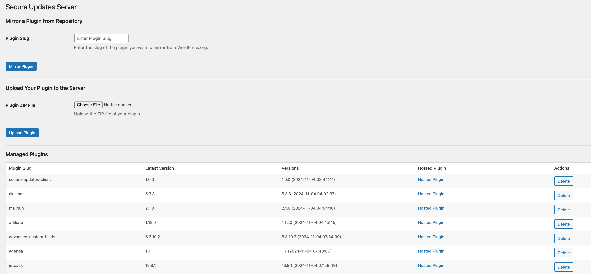
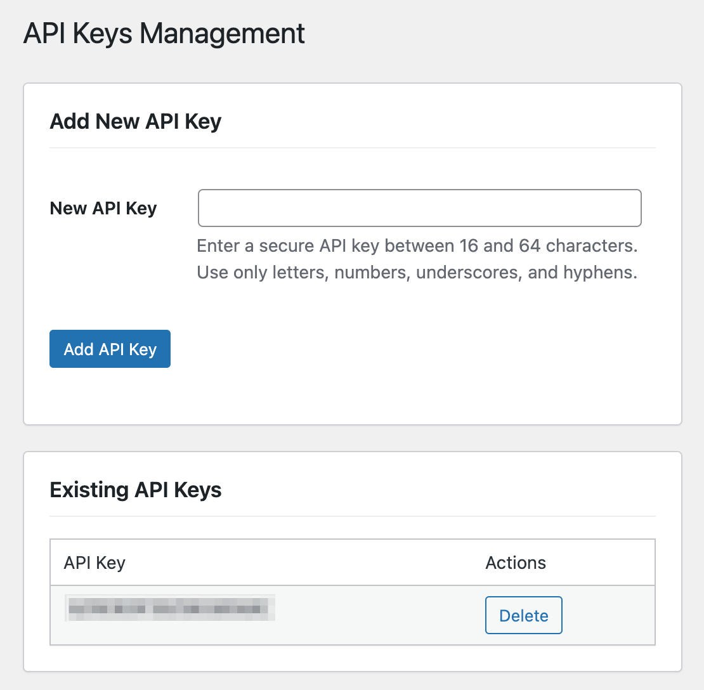

# Secure Updates Server

**Contributors:** Secure Updates Foundation  
**Tags:** updates server, plugin mirror, WordPress, media library, plugin updates, API keys  
**Requires at least:** 5.0  
**Tested up to:** 6.6.2  
**Stable tag:** 4.0  
**License:** GPLv2 or later  
**License URI:** [https://www.gnu.org/licenses/gpl-2.0.html](https://www.gnu.org/licenses/gpl-2.0.html)

## In Active Development, Not Production-Ready



## Description

**Secure Updates Server** is a comprehensive WordPress plugin designed to provide secure and controlled plugin updates. It caters to two primary user groups:

1. **Companies Managing Client Sites**: Mirror plugins from centralized repositories like WordPress.org to maintain greater control over plugin updates across multiple client sites. This ensures centralized management, enhanced security, and tailored update policies suitable for diverse client environments.

2. **Plugin Authors**: Simplify the distribution of updates by directly uploading plugins to the Secure Updates Server. This grants full control over versioning and release processes without relying on third-party repositories.



Key functionalities include:

- **Direct Plugin Uploads**: Upload plugin ZIP files directly to the server with support for versioning and rollbacks.
- **Mirroring from Repositories**: On-demand mirroring of plugins from repositories like WordPress.org.
- **Media Library Integration**: Store mirrored and uploaded plugins within the WordPress Media Library, enabling seamless integration with cloud offloading services.
- **API Key Management**: Securely authenticate client requests using API keys.
- **REST API Endpoints**: Facilitate communication between the server and clients through dedicated REST API endpoints.
- **Automated and Scheduled Tasks**: Automatically check for plugin updates and synchronize with client sites.
- **Enhanced Security**: Rigorous validation, permission checks, and secure handling of sensitive operations.

This plugin is part of the **Secure Updates Foundation** suite, empowering developers and organizations to maintain robust and secure update processes.

### Related Tools

> ### **Secure Updates Client**
>
> The **Secure Updates Client** plugin is designed for **client sites** managed by web hosts or providers offering managed WordPress services. It allows these sites to receive plugin updates directly from a designated **Secure Updates Server**, bypassing centralized repositories like WordPress.org. This setup provides increased security and control, making it ideal for environments that require stability and custom update policies.

> ### **Secure Updates Library**
>
> The **Secure Updates Library** is targeted at **plugin authors** who wish to distribute updates directly to their users. This lightweight library can be integrated into any plugin to enable updates from a self-hosted **Secure Updates Server**, providing plugin authors with full control over version distribution, making third-party repositories optional.

## Features

- **API Key Integration**: Securely authenticate client requests using API keys, ensuring that only authorized clients can access plugin updates.
- **Direct Plugin Uploads & Versioning**: Upload plugin ZIP files directly to the server with support for multiple versions and easy rollbacks.
- **1-Click Mirroring from WordPress.org**: Easily mirror plugins from WordPress.org repositories, ensuring centralized management of plugin updates.
- **Media Library Integration**: Store mirrored and uploaded plugins within the WordPress Media Library, enabling seamless integration with cloud offloading services like Amazon S3, DigitalOcean Spaces, and Google Cloud Storage.
- **REST API Endpoints**: Facilitate secure communication between the server and clients through dedicated REST API endpoints for downloading plugins, fetching plugin information, verifying file integrity, and handling plugin lists.
- **Automated & Scheduled Updates**: Automatically check for plugin updates on an hourly basis and synchronize mirrored plugins with the latest versions.
- **Checksum Verification**: Ensure the integrity of mirrored and uploaded plugins using SHA256 checksum verification.
- **Admin Interface Enhancements**: Manage mirrored and uploaded plugins, view version histories, handle API keys, and perform actions like deletion and rollbacks through an intuitive WordPress admin dashboard.
- **Enhanced Security Measures**: Implement rigorous input validation, nonce verification, and permission checks to secure all operations and data exchanges.
- **User Notifications**: Receive real-time notifications regarding plugin uploads, mirroring status, and any encountered errors to aid in monitoring and troubleshooting.

## Installation

1. **Download the Plugin:**
   - Clone the repository or download the ZIP file from the [Secure Updates Server GitHub Repository](https://github.com/secure-updates/secure-updates-server).

2. **Install via WordPress Admin:**
   - Navigate to `Plugins` > `Add New` > `Upload Plugin`.
   - Upload the `secure-updates-server.zip` file.
   - Click `Install Now` and then `Activate`.

3. **Configure the Plugin:**
   - After activation, navigate to `Secure Updates Server` in the WordPress admin menu.
   - **API Keys Setup:**
      - Go to `Secure Updates Server` > `API Keys`.
      - Add a new API key that clients will use to authenticate their requests.
   - **Mirroring Plugins:**
      - Navigate to `Secure Updates Server` > `Secure Updates Server`.
      - Enter the slug of the plugin you wish to mirror from WordPress.org and click `Mirror Plugin`.
   - **Uploading Plugins:**
      - Use the `Upload Your Plugin to the Server` section to upload plugin ZIP files directly.
   - **Manage Plugins:**
      - View, delete, or rollback managed plugins in the `Managed Plugins` section.

## Usage

### 1. **Managing API Keys**

- **Add a New API Key:**
   - Navigate to `Secure Updates Server` > `API Keys`.
   - Enter a secure API key (16-64 characters, containing only letters, numbers, underscores, and hyphens).
   - Click `Add API Key` to save.

- **Delete an Existing API Key:**
   - In the `API Keys` page, locate the API key you wish to delete.
   - Click the `Delete` button next to the respective API key and confirm the action.

### 2. **Mirroring a Plugin from Repository**

- Navigate to `Secure Updates Server` > `Secure Updates Server`.
- In the `Mirror a Plugin from Repository` section, enter the plugin slug (e.g., `akismet`) and click `Mirror Plugin`.
- The plugin will be fetched from WordPress.org, uploaded to the Media Library, and listed in the `Managed Plugins` table.

### 3. **Uploading a Plugin Directly to the Server**

- Navigate to `Secure Updates Server` > `Secure Updates Server`.
- In the `Upload Your Plugin to the Server` section, upload the plugin ZIP file.
- The plugin will be stored in the Media Library with versioning support, allowing for future rollbacks if necessary.

### 4. **Managing Mirrored and Uploaded Plugins**

- **View Managed Plugins:**
   - All mirrored and uploaded plugins are listed in the `Managed Plugins` table.
   - View details such as plugin slug, latest version, available versions, and hosting status.

- **Delete a Plugin:**
   - Click the `Delete` button next to the plugin you wish to remove.
   - Confirm the deletion to remove the plugin from the server and Media Library.

- **Rollback to a Previous Version:**
   - In the `Managed Plugins` table, locate the plugin and view its version history.
   - Select the desired version and initiate a rollback to replace the current version with the selected one.

### 5. **Client Configuration with Secure Updates Client**

- On the client site, install and activate the **Secure Updates Client** plugin.
- Navigate to `Settings` > `Secure Updates Client`.
- Enter the Custom Host URL (your Secure Updates Server URL) and the API key generated from the server.
- Test the connection to ensure successful communication between the client and server.
- Enable updates from the custom host to receive plugin updates securely.

## Frequently Asked Questions

### How do API keys enhance security?

API keys ensure that only authorized clients can access and retrieve plugin updates from the Secure Updates Server. Each client must present a valid API key in their requests, preventing unauthorized access and enhancing the overall security of the update process.

### Can I manage multiple versions of a plugin?

Yes, Secure Updates Server supports versioning for both mirrored and uploaded plugins. You can upload multiple versions of a plugin, allowing you to rollback to previous versions if needed, ensuring stability across client sites.

### How does Media Library integration work with cloud storage?

Secure Updates Server stores all mirrored and uploaded plugins within the WordPress Media Library. By integrating with cloud offloading plugins like [Offload Media – Cloud Storage](https://wordpress.org/plugins/offload-media-cloud-storage/), these files can be automatically offloaded to cloud storage services such as Amazon S3, DigitalOcean Spaces, or Google Cloud Storage, optimizing server storage and enhancing scalability.

### What should my custom host support?

Your custom host (Secure Updates Server) should have the Secure Updates Server plugin installed and properly configured. It should support REST API endpoints for handling plugin downloads, information retrieval, file verification, and plugin list management. Ensure that API keys are securely managed and that the server is accessible to client sites.

### How do I obtain an API key for the custom host?

API keys are managed through the `API Keys` section in the Secure Updates Server admin interface. As an administrator, you can generate new API keys and distribute them to authorized client sites. Each client site must use its unique API key to authenticate requests to the server.

### Can I use Secure Updates Server with existing cloud offloading plugins?

Absolutely! Secure Updates Server integrates seamlessly with the WordPress Media Library, making it compatible with any media offloading plugin. Ensure that your chosen cloud offloading plugin is properly configured to handle Media Library files, allowing automatic offloading of plugin ZIP files to your preferred cloud storage service.

## Changelog

### 4.0

- **API Key Management:** Introduced a dedicated interface for adding, deleting, and managing API keys to securely authenticate client requests.
- **Enhanced REST API Endpoints:** Added a new REST API endpoint for handling plugin list requests, enabling clients to synchronize their installed plugins with the server.
- **Direct Plugin Uploads & Versioning:** Implemented the ability to upload plugin ZIP files directly to the server with support for multiple versions and easy rollbacks.
- **Media Library Integration:** Replaced direct cloud storage integrations with seamless integration through the WordPress Media Library, enhancing compatibility with various cloud offloading plugins.
- **Improved Admin Interface:** Enhanced the admin dashboard for better management of mirrored and uploaded plugins, including detailed version histories and streamlined actions.
- **Scheduled Update Checks:** Updated the scheduled tasks to perform hourly checks for plugin updates, ensuring timely synchronization with the latest plugin versions.
- **Security Enhancements:** Strengthened security measures by implementing rigorous input validation, nonce verification, and permission checks across all operations.
- **Logging & Notifications:** Improved logging for better troubleshooting and introduced user notifications for successful operations and encountered errors.

### 3.0

- **Direct Plugin Upload Capability:** Enabled administrators to upload plugin ZIP files directly to the server, facilitating custom plugin distribution.
- **Versioning and Rollback Features:** Added support for multiple plugin versions and the ability to rollback to previous versions as needed.
- **Media Library Storage:** Integrated plugin storage with the WordPress Media Library, allowing for easy management and cloud offloading compatibility.
- **Enhanced Logging and Error Handling:** Improved logging mechanisms and error handling processes to aid in monitoring and troubleshooting.
- **Admin Interface Improvements:** Refined the admin dashboard for better usability in managing mirrored and uploaded plugins.

### 2.0

- **AWS S3 Storage Integration:** Implemented integration with Amazon S3 for storing mirrored plugins, enabling scalable and reliable storage solutions.
- **On-Demand Mirroring:** Added functionality to mirror plugins from repositories like WordPress.org on demand based on client requests.
- **Checksum Verification:** Introduced SHA256 checksum verification to ensure the integrity and authenticity of mirrored and uploaded plugins.
- **Admin Interface Enhancements:** Improved the admin dashboard for more efficient management of mirrored plugins and their versions.

### 1.0

- **Initial Release:** Launched the Secure Updates Server with basic plugin mirroring from WordPress.org and an admin interface for managing mirrored plugins.

## Upgrade Notice

### 4.0

**Major Update:** Version 4.0 introduces significant enhancements including API key management for secure client authentication, direct plugin uploads with versioning and rollback capabilities, and seamless integration with the WordPress Media Library for optimized storage. Additionally, REST API endpoints have been expanded to facilitate comprehensive communication between the server and clients.

**Action Required:**
- **API Keys:** Review and manage your existing API keys. Generate new keys as needed to ensure secure access for client sites.
- **Configuration:** Verify that your media offloading plugin (e.g., Offload Media – Cloud Storage) is properly configured to handle plugin ZIP files stored in the Media Library.
- **Testing:** After upgrading, test the connection with client sites to ensure that API keys are correctly implemented and that plugin mirroring and uploads function as expected.

### 3.0

**Major Update:** Version 3.0 adds direct plugin upload capabilities, versioning support, and integrates plugin storage with the WordPress Media Library. This enhances the flexibility and scalability of the Secure Updates Server, allowing for more efficient plugin management and distribution.

**Action Required:**
- **Migration:** If previously using direct cloud storage integrations, transition to using the WordPress Media Library for plugin storage.
- **Versioning:** Familiarize yourself with the new versioning and rollback features to effectively manage plugin updates.

### 2.0

**Update:** Version 2.0 introduces AWS S3 storage integration, on-demand mirroring from repositories, and checksum verification for enhanced security.

**Action Required:**
- **AWS S3 Configuration:** If utilizing AWS S3 for storage, ensure that your credentials and configurations are correctly set up.
- **Security:** Regularly monitor checksum verifications to maintain plugin integrity.

### 1.0

**Initial Release:** The initial version of Secure Updates Server provides basic plugin mirroring from WordPress.org and an admin interface for managing mirrored plugins.

## License

This plugin is licensed under the GPLv2 or later. You can find the license [here](https://www.gnu.org/licenses/gpl-2.0.html).

## Current Implementation

1. **API Key Management:**
   - Administrators can add, delete, and manage API keys through the admin interface.
   - API keys are used to authenticate client requests, ensuring secure communication between the server and clients.

2. **Media Library Integration:**
   - Mirrored and uploaded plugins are stored within the WordPress Media Library.
   - Compatible with cloud offloading plugins like [Offload Media – Cloud Storage](https://wordpress.org/plugins/offload-media-cloud-storage/), enabling automatic offloading of plugin ZIP files to preferred cloud storage services.

3. **Direct Plugin Uploads & Versioning:**
   - Administrators can upload plugin ZIP files directly through the admin dashboard.
   - Each upload can specify a version, and multiple versions are maintained to allow rollbacks if necessary.

4. **REST API Endpoints:**
   - **Download Endpoint:** Allows clients to download plugin ZIP files.
   - **Info Endpoint:** Provides plugin information such as name, version, author, and download link.
   - **Connected Endpoint:** Confirms the server's connectivity status.
   - **Verify File Endpoint:** Checks the integrity of plugin files using checksum verification.
   - **Plugin List Endpoint:** Handles synchronization of plugin lists from client sites.

5. **Automated Update Checks:**
   - Scheduled tasks run hourly to check for updates to mirrored plugins from WordPress.org.
   - If a newer version is available, the plugin is automatically mirrored and updated in the Media Library.

6. **Security Measures:**
   - All REST API requests from clients must include a valid API key in the Authorization header.
   - Nonce verification and capability checks are enforced for all admin actions to prevent unauthorized access.

7. **Admin Interface:**
   - **Mirroring Plugins:** Easily mirror plugins from WordPress.org by entering their slug.
   - **Uploading Plugins:** Upload custom plugins directly with versioning support.
   - **Managing Plugins:** View, delete, and rollback plugins through an intuitive table interface.
   - **API Keys Management:** Add and remove API keys to control client access.

## Todos

### Planned Enhancements

1. **Support for Additional Plugin Sources:**  
   Expand mirroring capabilities to include other repositories like GitHub, Bitbucket, and custom sources to provide more flexibility in plugin management.

2. **Improved Rollback Functionality:**  
   Enhance the rollback feature to automatically handle file replacements and ensure seamless transitions between plugin versions.

3. **Enhanced Error Handling:**  
   Provide more detailed error messages and incorporate an error log viewer within the admin interface for better monitoring and troubleshooting.

4. **User Notifications:**  
   Integrate email or dashboard notifications for administrators regarding plugin uploads, mirroring status, and any encountered errors.

5. **API Enhancements:**  
   Develop additional REST API endpoints to support more granular control and integration with third-party tools and services.

6. **Testing & Quality Assurance:**  
   Implement comprehensive unit and integration tests, conduct regular security audits, and ensure compliance with WordPress coding standards.

## Contributing

We welcome contributions from the community! If you'd like to contribute to the project, please follow these steps:

1. **Fork the Repository:**  
   Click the 'Fork' button at the top of the repository page.

2. **Clone Your Fork:**  
   Clone your forked repository to your local machine.

   ```bash
   git clone https://github.com/yourusername/secure-updates-server.git
   ```

3. **Create a Branch:**  
   Create a new branch for your feature or bugfix.

   ```bash
   git checkout -b feature/your-feature-name
   ```

4. **Make Changes:**  
   Implement your feature or fix the bug.

5. **Commit and Push:**  
   Commit your changes and push to your fork.

   ```bash
   git add .
   git commit -m "Description of your changes"
   git push origin feature/your-feature-name
   ```

6. **Submit a Pull Request:**  
   Go to the original repository and submit a pull request from your branch.

We appreciate your contributions and will review your pull request as soon as possible!

---

### Summary of Updates in Version 4.0

- **API Key Management:** Introduced a dedicated interface for adding, deleting, and managing API keys to securely authenticate client requests.
- **Enhanced REST API Endpoints:** Added a new REST API endpoint for handling plugin list requests, enabling comprehensive synchronization between server and clients.
- **Direct Plugin Uploads & Versioning:** Implemented the ability to upload plugin ZIP files directly with support for multiple versions and easy rollbacks.
- **Media Library Integration:** Seamlessly integrated plugin storage with the WordPress Media Library, enhancing compatibility with various cloud offloading plugins.
- **Scheduled Update Checks:** Updated scheduled tasks to perform hourly checks for plugin updates, ensuring timely synchronization with the latest versions.
- **Security Enhancements:** Strengthened security measures through rigorous input validation, nonce verification, and permission checks across all operations.
- **Admin Interface Enhancements:** Improved the admin dashboard for better usability in managing mirrored and uploaded plugins, including detailed version histories and streamlined actions.
- **Logging & Notifications:** Enhanced logging mechanisms for better monitoring and introduced user notifications for successful operations and encountered errors.

